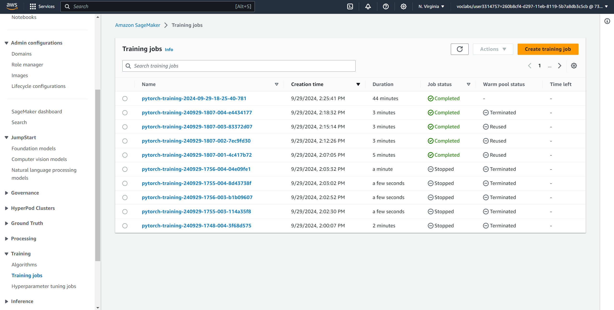
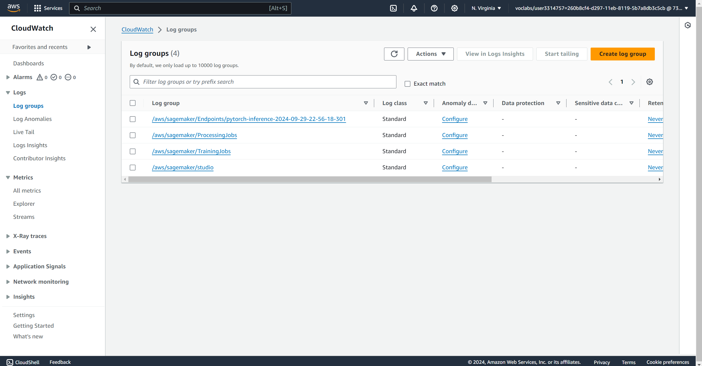
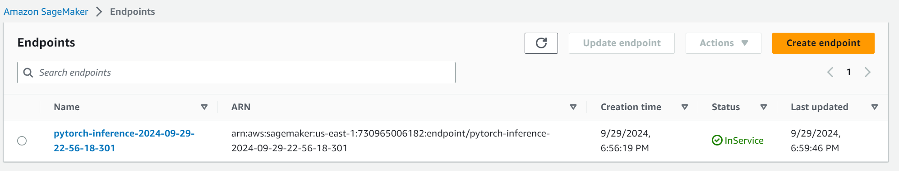
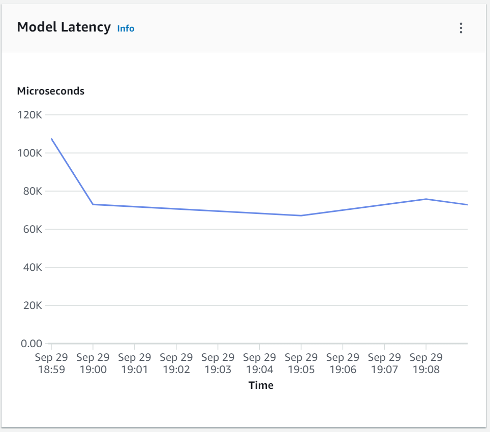
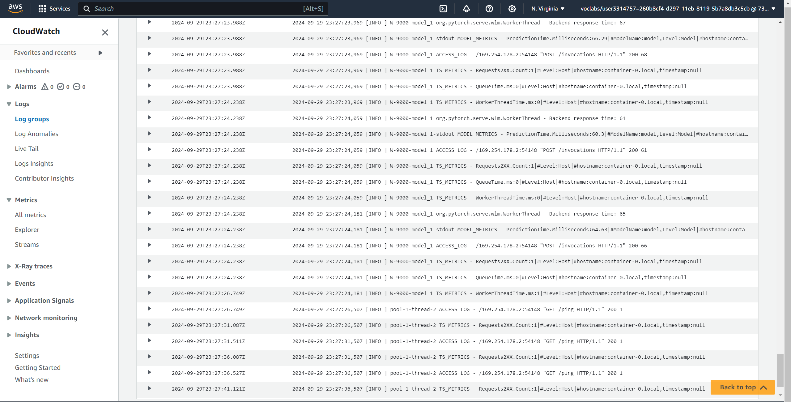

# Image Classification using AWS SageMaker

Use AWS Sagemaker to train a pretrained model that can perform image classification by using the Sagemaker profiling, debugger, hyperparameter tuning and other good ML engineering practices. This can be done on either the provided dog breed classication data set or one of your choice.

## Project Set Up and Installation

Enter AWS through the gateway in the course and open SageMaker Studio.
Download the starter files.
Download/Make the dataset available.

## Dataset

The provided dataset is the dogbreed classification dataset which can be found in the classroom.
The project is designed to be dataset independent so if there is a dataset that is more interesting or relevant to your work, you are welcome to use it to complete the project.

### Access

Upload the data to an S3 bucket through the AWS Gateway so that SageMaker has access to the data.

## Hyperparameter Tuning

What kind of model did you choose for this experiment and why? Give an overview of the types of parameters and their ranges used for the hyperparameter search

I fine-tuned the resnet50 model with the following fully-connected layer:
nn.Sequential(nn.Linear(num_features, 256),
                nn.ReLU(),
                nn.Linear(256, 128),
                nn.ReLU(),
                nn.Linear(128,  num_classes),
                nn.LogSoftmax(dim=1))

- hyperparameter_ranges
  - 'lr': 0.001, 0.1
  - 'batch_size': 16, 32, 64
  - 'epochs': 2, 6

These hyperparameters determine the length of training, quality and speed of training and also helps us identify the pros and cons of batch_sizes with respect to learning quality and hardware limitations.

- These are the best Hyperparameters:
  - batch_size: 64
  - epochs: 2
  - lr: 0.0047518352618877565

- Finished Training Jobs:

- Cloudwatch Log Groups

## Debugging and Profiling

I did profiling with smdebug and created a complete report with graphs and visuals in Sagemaker about the training process.

### Results

After performing profiling and debugging, some suggestions were evaluated:

- Choose a different distributed training strategy or a different distributed training framework.  

- Check if there are any bottlenecks (CPU, I/O) correlated to the step outliers.

- Check if there are bottlenecks, minimize blocking calls, change distributed training strategy, or increase the batch size.

- Consider increasing the number of data loaders or applying data pre-fetching.  

- Choose a larger instance type with more memory if footprint is close to maximum available memory.

- Pre-fetch data or choose different file formats, such as binary formats that improve I/O performance

- The batch size is too small, and GPUs are underutilized. Consider running on a smaller instance type or increasing the batch size.

## Model Deployment

The model was deployed on the ml.m5.2xlarge with the deploy_endpoint.py script.

- Endpoint

- Model Latency

- Cloudwatch logging

